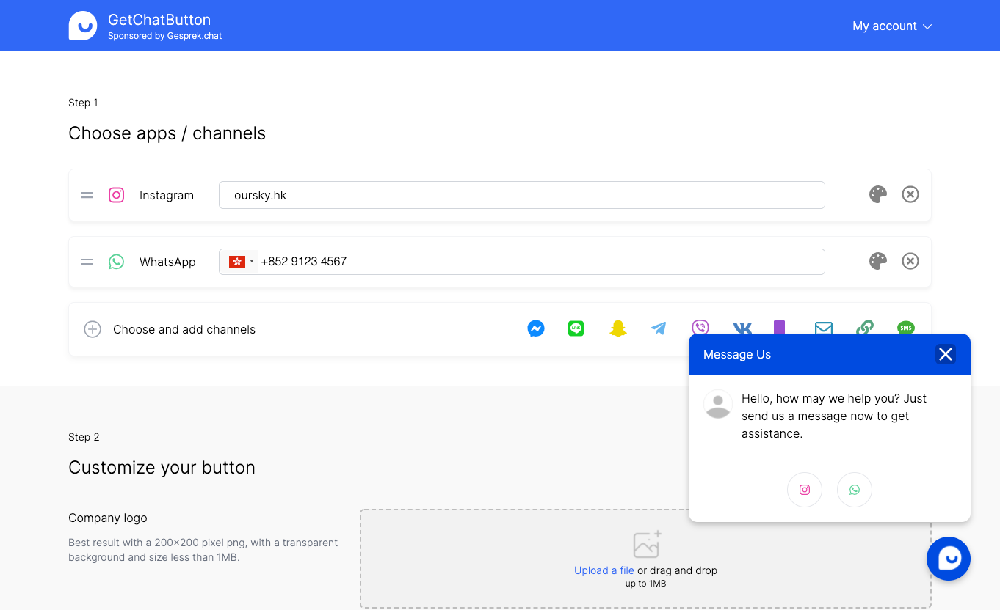

# GetChatButton

This project is done as part of the internship at [Oursky Limited](https://oursky.com). It generates a JavaScript snippet which can be attached in any website, to embed chat room functionality and contacts.

Built with NextJS with Prisma ORM. Deployed to GKE Kubernetes Cluster via GitLab CI.

Site link: [https://www.getchatbutton.com/](https://www.getchatbutton.com)&#x20;



### Example generated chat button code

Paste the below code before the body tag on any webpage.

<details>

<summary>Code</summary>

```html
<!-- Getchatbutton.com widget -->
<script type="text/javascript">
var refJSON = {"greetingTitle":"Message Us","greetingMessage":"Hello, how may we help you? Just send us a message now to get assistance.","position":"right","primaryColor":"#004BE0","isDefaultMainCBImage":true,"mainCBImage":"https://app.getchatbutton.com/assets/cb/cb/main-transparent.png","bottomLabel":null,"callToAction":"Contact Us Now","greetingIcon":"https://app.getchatbutton.com/assets/cb/cb/empty-avatar.png","items":[{"name":"Instagram","slug":"ig","target":"oursky.hk","color":"#EB43A7","faName":["fab","instagram"],"link":"https://instagram.com/","placeholder":"Page name (e.g. teamsnapchat)"},{"name":"WhatsApp","slug":"whatsapp","target":"+85291234567","color":"#59D298","faName":["fab","whatsapp"],"link":"https://wa.me/","placeholder":"Phone number (e.g. +1 123456789)","showInputHint":false}],"env":"production"}
var baseURL = "https://static.getchatbutton.com"

function loadCB() {

  var rootDiv = document.createElement("div")
  rootDiv.id = "oursky-cb"
  document.body.appendChild(rootDiv)

  var fbRoot = document.createElement("div")
  fbRoot.id = "fb-root"
  fbRoot.style.opacity = "0"
  document.body.appendChild(fbRoot)

  var fbCustomerChat = document.createElement("div")
  fbCustomerChat.id = "fb-customer-chat"
  fbCustomerChat.classList.add("fb-customerchat")
  document.body.appendChild(fbCustomerChat)

  if (!document.getElementById("facebook-jssdk")) {
    var script = document.createElement("script")
    script.src = "https://connect.facebook.net/en_US/sdk/xfbml.customerchat.js"
    script.crossOrigin = "anonymous"
    document.body.appendChild(script)
  }


  fetch(baseURL + '/asset-manifest.json')
    .then(function (response) { return response.json() })
    .then(function (data) {

      const entryPoints = data.entrypoints
      entryPoints.forEach(function (entryPoint) {
        var url = baseURL + '/' + entryPoint
        if (url.endsWith(".js")) {
          var script = document.createElement("script")
          script.src = url
          document.body.appendChild(script)
        } else if (url.endsWith(".css")) {
          var stylesheet = document.createElement("link")
          stylesheet.href = url
          stylesheet.rel = "stylesheet"
          document.head.appendChild(stylesheet)
        }
      })
      // console.log("[cb] script loaded")
    })
    .catch(function (error) {
      console.error("[cb] unable to load GetChatButton from manifest")
    })
}

if (document.readyState !== 'complete') {
  window.addEventListener('load', loadCB)
} else {
  loadCB()
}
    
</script>

```

</details>

